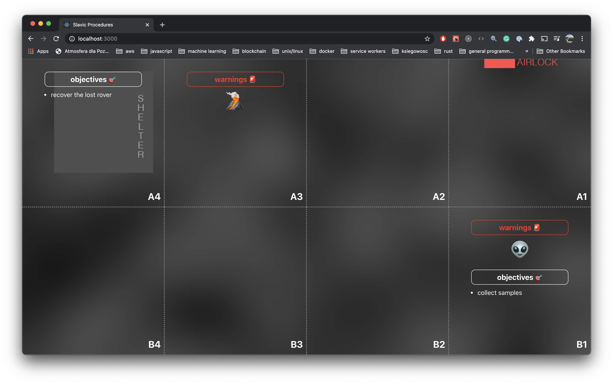
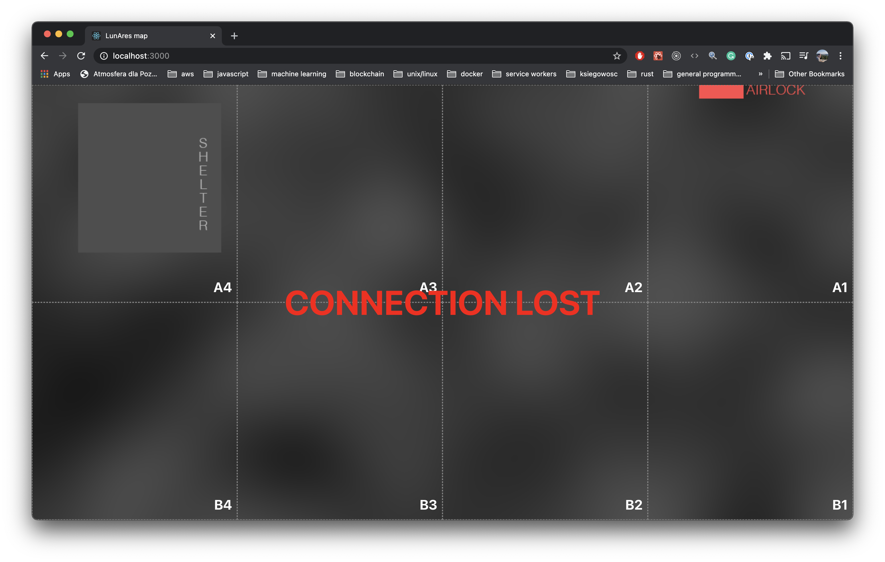

# lunares map client

A client map application, to be used with [lunares-map-server](https://github.com/belfz/lunares-map-server).

## requirements

1. node.js (tested with v15.8.0)
2. yarn (tested with v1.16.0)

## instructions to run

1. run [lunares-map-server](https://github.com/belfz/lunares-map-server) and obtain the server's address in local network
2. run `yarn` to install packages
3. adjust the value of `WS_SERVER_ADDRESS` in `src/App.tsx` with the server's address and port (see point 1)
4. run `yarn start` to run the application (on port 3000)

## how to use

1. simply open `http://localhost:3000` in your browser
2. dispatch events with [lunares-map-server](https://github.com/belfz/lunares-map-server) and watch how the map updates automatically
3. in case a connection to the lunares-map-server is lost, a message will be displayed (see examples below) & the app will try to reconnect every 5 seconds

## example

Map UI with events

Map UI - disconnected state

